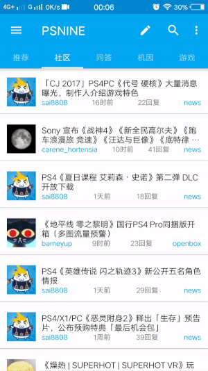

# Psnine
Psnine第三方安卓客户端, 基于React Native、Redux, 支持安卓4.1及以上系统 

# Features
- 支持PSNINE网站的所有功能
- 支持自动签到、消息快捷回复、回复中插入图片、拍摄图片后直接上传、非WIFI环境懒加载图片等功能
- 支持网易云音乐和B站链接的客户端跳转
- 支持主题的切换, 可以切换首页布局和19种主题颜色, 以及对应的强调色和夜间主题

# Screenshots
<a href="art/1.gif"></a>
<a href="art/2.gif"></a>
<a href="art/3.gif"></a>

# Download
> [https://fir.im/mf24](https://fir.im/mf24)

# Changelog
请查看[Release页面](https://github.com/smallpath/psnine/releases)

# Statement
该项目已取得Psnine官方的第三方应用授权

# Todo
- [ ] 重构 (1.0.0)
  - [ ] react-native-navigation
  - [ ] react-native-interactable (IOS)
  - [x] collapse-toolbar-layout (Android)
  - [x] coordinator-layout (Android)
  - [x] nested-scroll-view (Android)
  - [x] react-native-fs
  - [x] react-native-share
  - [x] react-native-snackbar
  - [x] react-native-image-picker
  - [x] react-native-vector-icons
  - [x] react-native-linear-gradient
  - [x] react-native-google-analytics-bridge
- [ ] 兼容 (1.0.0)
  - [ ] IOS
  - [x] 安卓从5.0兼容至4.1


# Contribution
如果发现了漏洞或者需要新功能, 请在本仓库新建issue, 也可联系邮箱`smallpath2013@gmail.com`

# License
```
Copyright (C) 2017 smallpath

Licensed under the Apache License, Version 2.0 (the "License");
you may not use this file except in compliance with the License.
You may obtain a copy of the License at

    http://www.apache.org/licenses/LICENSE-2.0

Unless required by applicable law or agreed to in writing, software
distributed under the License is distributed on an "AS IS" BASIS,
WITHOUT WARRANTIES OR CONDITIONS OF ANY KIND, either express or implied.
See the License for the specific language governing permissions and
limitations under the License.
```